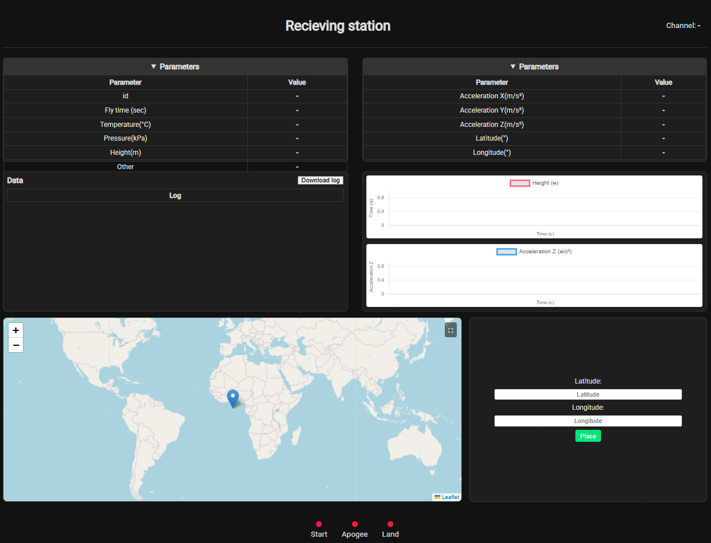

# Radio RaCEBoards ESP32

Project based on *[RaCEBoards-ESP32](https://github.com/innopoltech/RaCEBoards-ESP32/tree/main)*

---

This project implements a receiving station for telemetry data using the Ra01S LoRa module and an ESP32 microcontroller. The station receives telemetry data from experimental fly models, processes it, and displays it on a web interface with real-time updates.



## Features

- **LoRa Communication**: Uses the Ra01S LoRa module for receiving telemetry data.
- **Web Interface**: Displays telemetry data in real-time using a responsive web interface.
- **Data Visualization**: Includes charts for altitude and acceleration over time.
- **Map Integration**: Displays the location of the telemetry source on a map using Leaflet.
- **Channel Switching**: Allows switching between different radio channels (1 to 6).
- **Data Logging**: Logs received data and allows downloading it as a text file.

## Project Structure

```
├── main.py              # Main script for the receiving station
├── radio_receive.html   # HTML template for the web interface
├── style.css            # CSS for styling the web interface
├── lib/                 # Library folder containing required modules
│   ├── Ra01S.py         # Driver for the Ra01S LoRa module
│   ├── adafruit_httpserver/ # HTTP server library
│   └── ...              # Other utility modules
└── README.md            # Project documentation
```


## Requirements

- **Hardware**:
  - ESP32 microcontroller
  - Ra01S LoRa module
  - Buzzer (optional)
  - Button for channel switching
- **Software**:
  - CircuitPython
  - Required libraries (e.g., `adafruit_httpserver`, `asyncio`, etc.)

## Setup

1. **Hardware Connections**:
   - Connect the Ra01S module to the ESP32 using SPI pins.
   - Connect a button to the designated GPIO pin for channel switching.
   - Optionally, connect a buzzer to the specified GPIO pin.

2. **Install Dependencies**:
   - Copy the required libraries to the `lib/` folder on the ESP32.

3. **Configure WiFi**:
   - Update the `ssid` and `password` variables in `main.py` with your WiFi credentials.

4. **Run the Project**:
   - Upload the project files to the ESP32.
   - Run `main.py` to start the receiving station.

## Usage

1. **Access the Web Interface**:
   - Connect to the same WiFi network as the ESP32.
   - Open a browser and navigate to the ESP32's IP address.

2. **View Telemetry Data**:
   - The web interface displays real-time telemetry data, including parameters like altitude, temperature, and acceleration.

3. **Switch Channels**:
   - Press the button to switch between radio channels (1 to 6).

4. **Download Logs**:
   - Use the "Download log" button on the web interface to save received data as a text file.

## Web Interface

The web interface includes the following sections:

- **Parameters**: Displays telemetry data such as altitude, temperature, and acceleration.
- **Charts**: Visualizes altitude and acceleration over time using Chart.js.
- **Map**: Shows the location of the telemetry source on a map using Leaflet.
- **Indicators**: Displays flags for start, apogee, and landing events.

## License

This project is licensed under the MIT License. See the `LICENSE` file for details.

## Acknowledgments

- [Adafruit](https://www.adafruit.com/) for providing CircuitPython libraries.
- [Leaflet](https://leafletjs.com/) for map integration.
- [Chart.js](https://www.chartjs.org/) for data visualization.